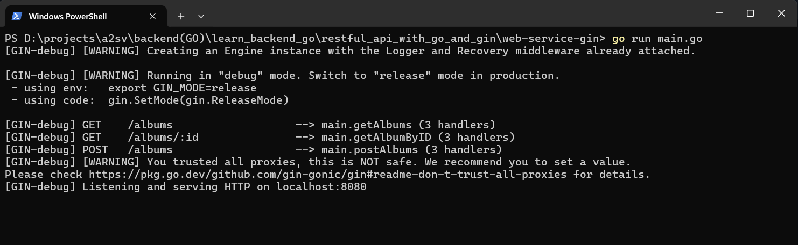
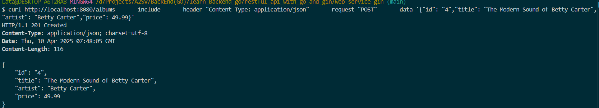
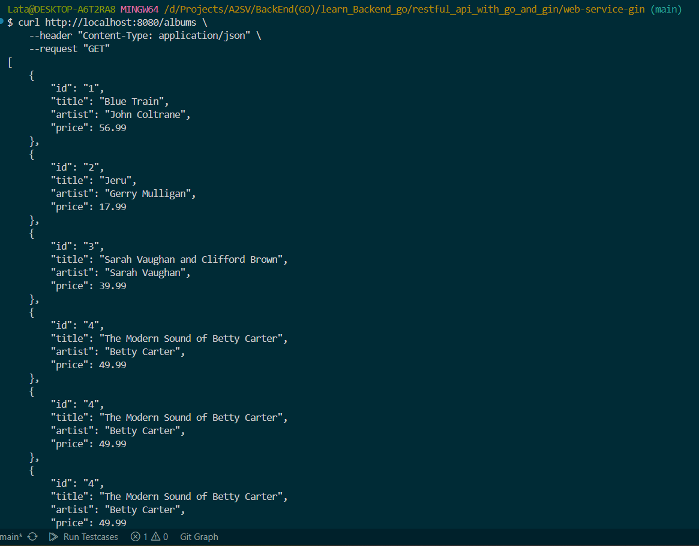
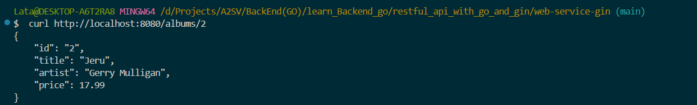

This file containes results of the program after running it.

1. Run the server in localhost mode

   - The below image demostatrates the server is running in localhost port 8080
     

2. create an album

   - Album creation is demonstrated as below image using curl command
     

3. get albums

   - Get albums is demonstrated in the below image using curl command
     

4. Get specific album
   - This can be seen in the following image using curl command
     
