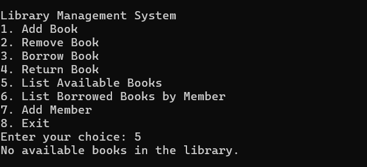
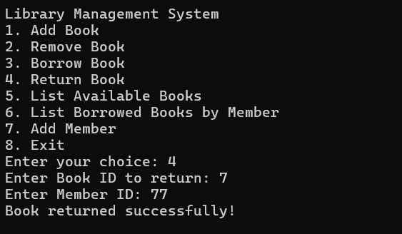

This file containes the implementation results of the code. You could say it is a demo in the form of images.

1. Add Books and Add Member

   - Add book and add member is demonstrated in the following image.
     

2. List All Available Books

   - All available books are demonstrated in the following image.
     

3. Borrow Book

   - Borrow a book by a member is demonstrated here in the following image.
     

4. List Borrowed Books by a member

   - List a book borrowed by a member is demonstarted in the following image.
     

   - After borrowing the book list of all available books become empty. These can be seen in the following image.
     

5. Return Book

   - Returning the book to the library is demonstrated here in the following image.
     

   - Here we can see the borrowed book is empty after returning the book.
     

   - Now we can also see the list of all available books which includes the returned book. These can be seen in the below image.
     

6. Remove a Book

   - A book can be removed from the library. These is demonstarated in the following image.
     

   - Now we can check if the available books is empty, after removing. These can be seen in the following image.
     
