Here are the demo of the project shown by image taken as screeshots of main functionality of the program.
Follow the following steps to see them

1.  Connect to mongodb and Run the project:
    Below image shows that the project is connected to mongodb and running.

    - 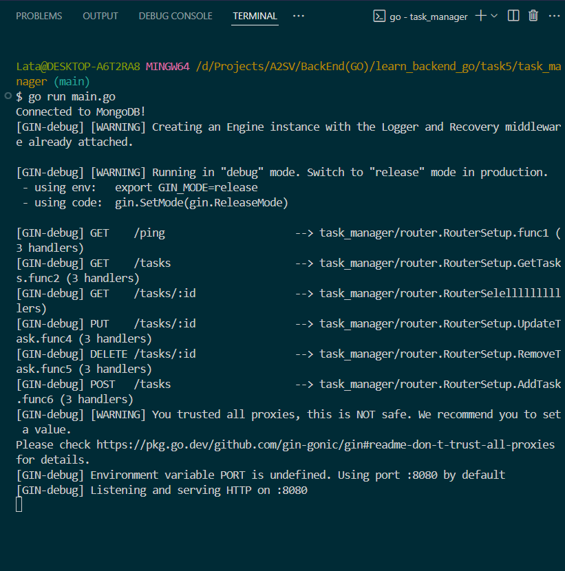

    Below image shows that database called 'task_manager' has been created with collection called 'tasks'.

    - 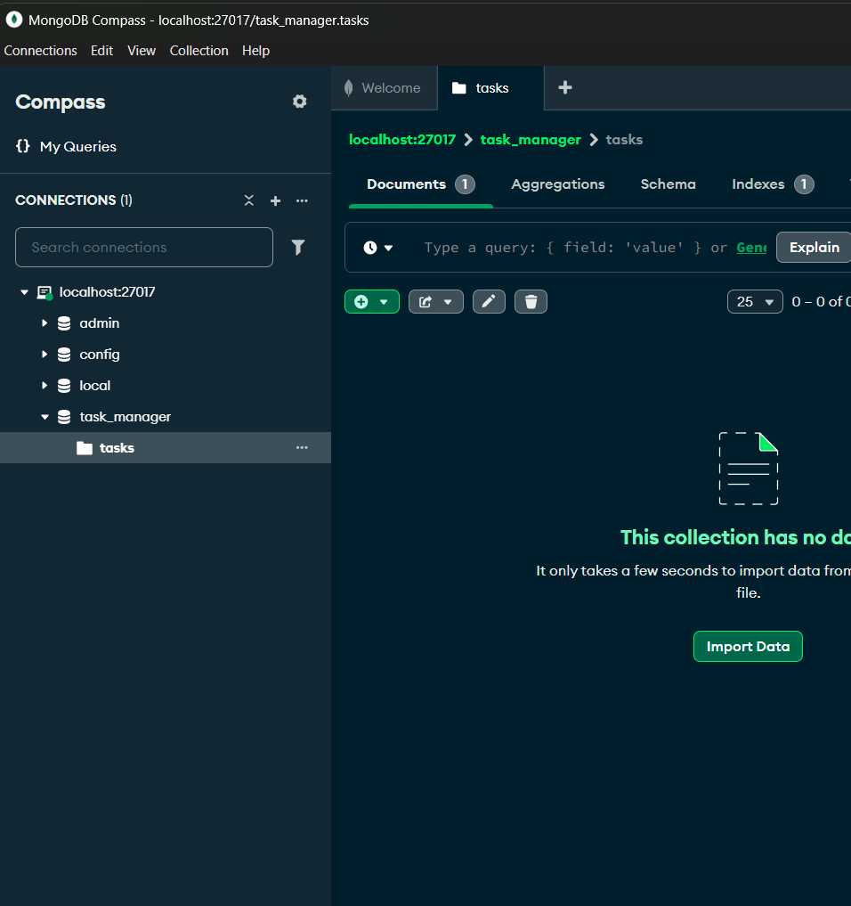

2.  Test the api's
    Test Add Task
    Below image shows that postman call to the api and task being added.

    - 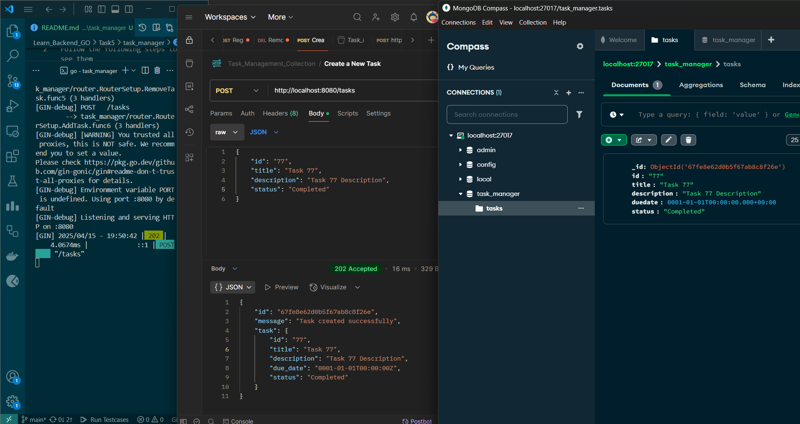

      Add one more task

      - 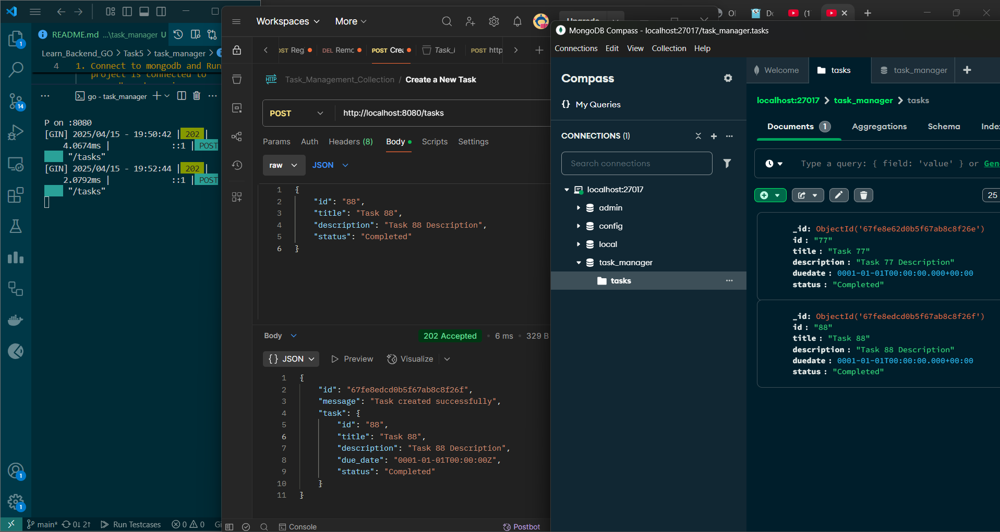

    Get all tasks
    Below image shows that get all tasks fetches all tasks.

    - 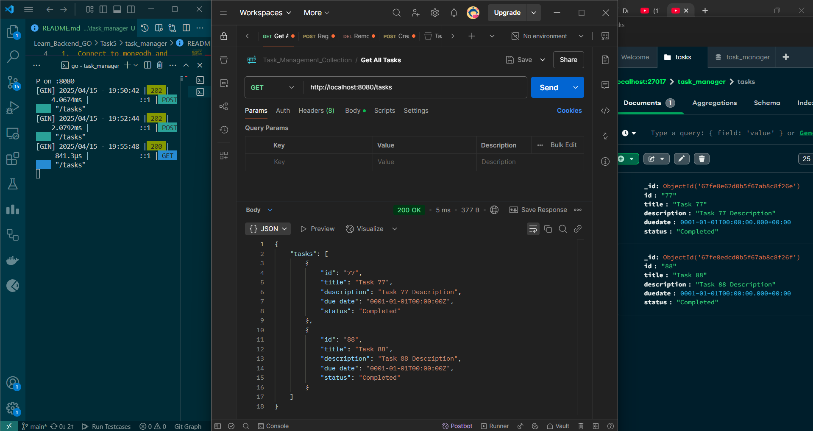

    Get specific task
    Below images shows that tasks can be fetched by their specific id:

    - 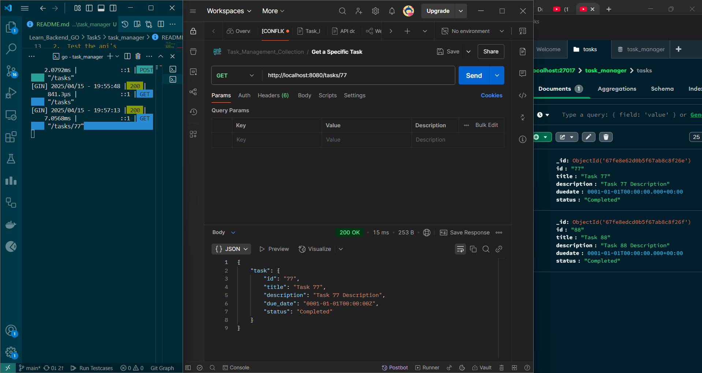

    If no task exists by that id it displays no task found

    - 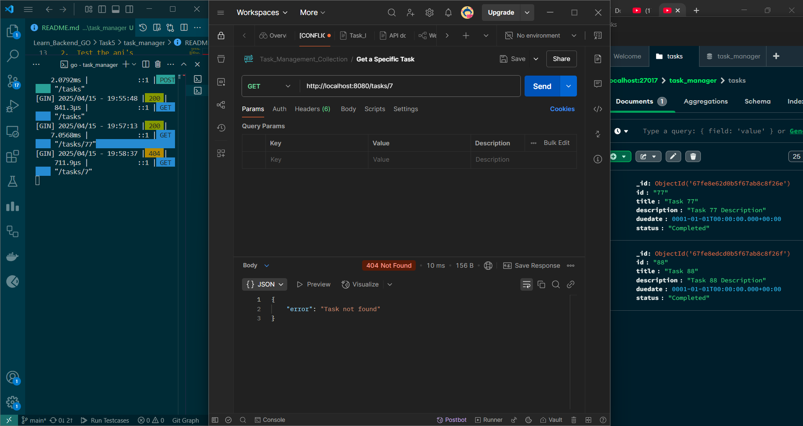

    Update task
    Below image shows that tasks can be updated by their specific id:

    - 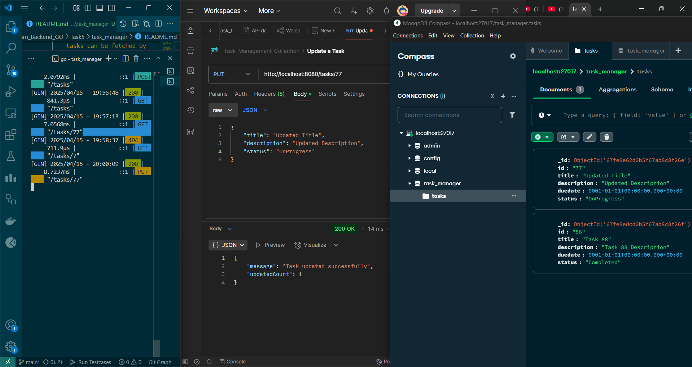

    If no task found to be update it wil return no task found

    - 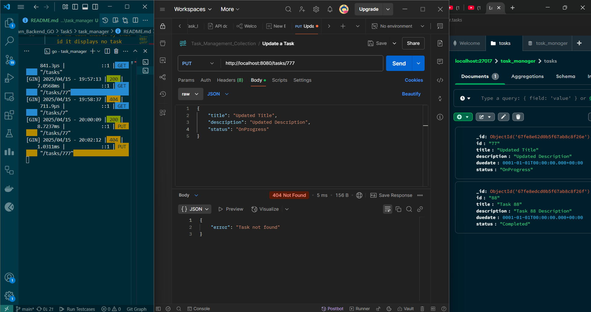

    Remove task
    Task can also be removed using their task id.

    - 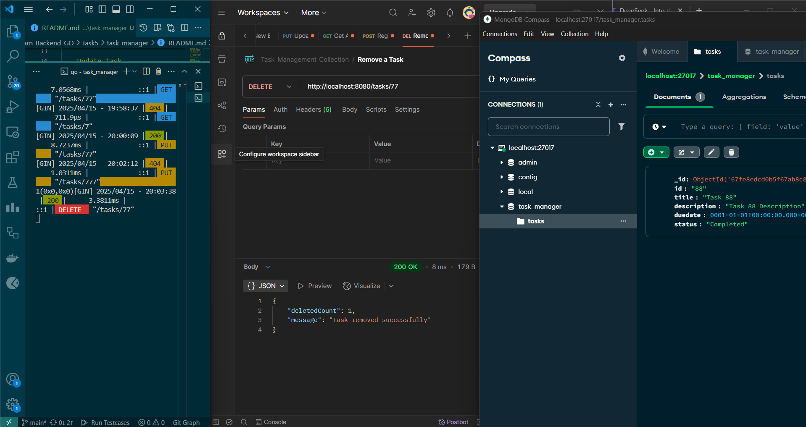

    If task we are trying to remove does not exist it will return task not found

    - 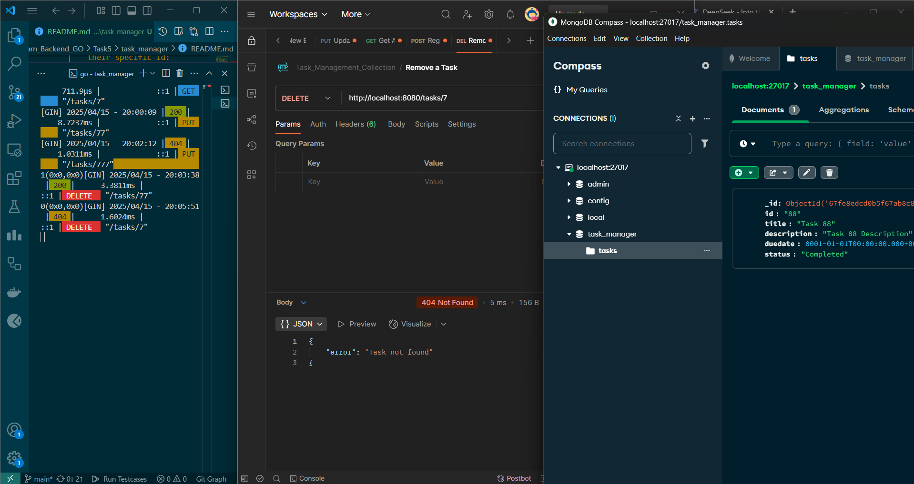
