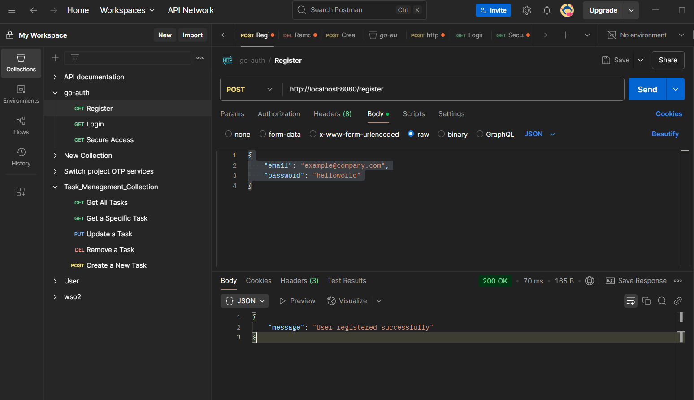

To run this project you have to do the following command
go run .

go run main does not work for this because it will leave out user.go file. they both are inside main package. so to include both run all files under the project.

1. Register a user

   - user can be registered using their email address and password
     

2. Login a user

   - user can login to the system using their email address and password they used to create their account
     

3. Check if the paths are protected or not.
   - We can check if we can open home page("/").
     a. when we use the token we can successfully login as shown below
     
     b. when we don't use token we are not able to access the homepage as shown below
     
