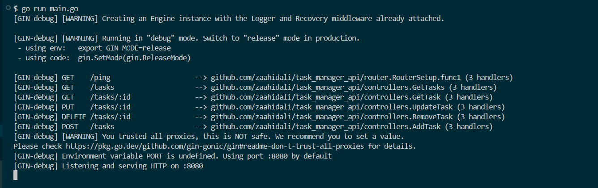
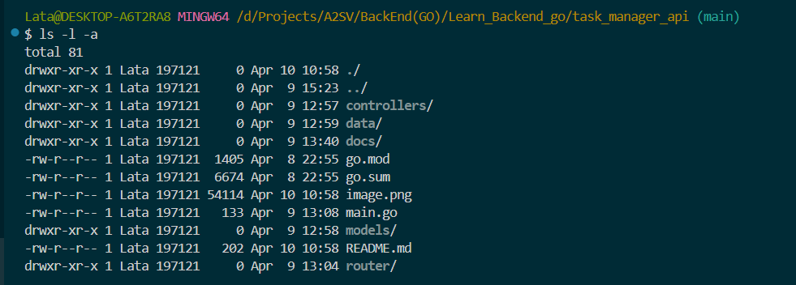
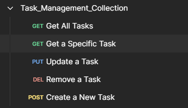
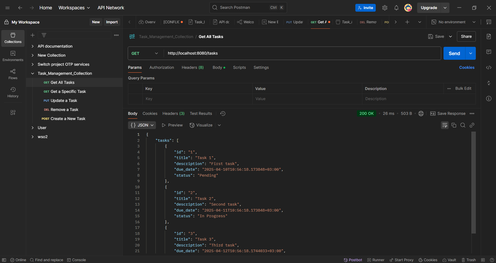
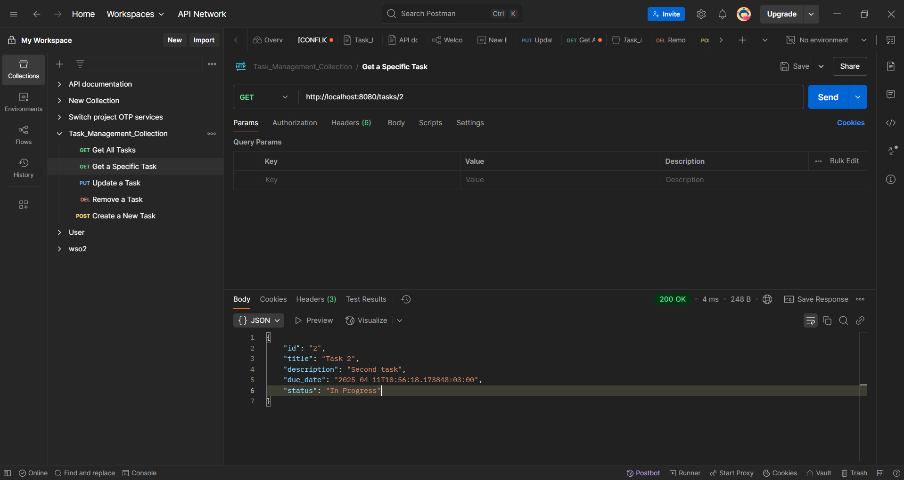
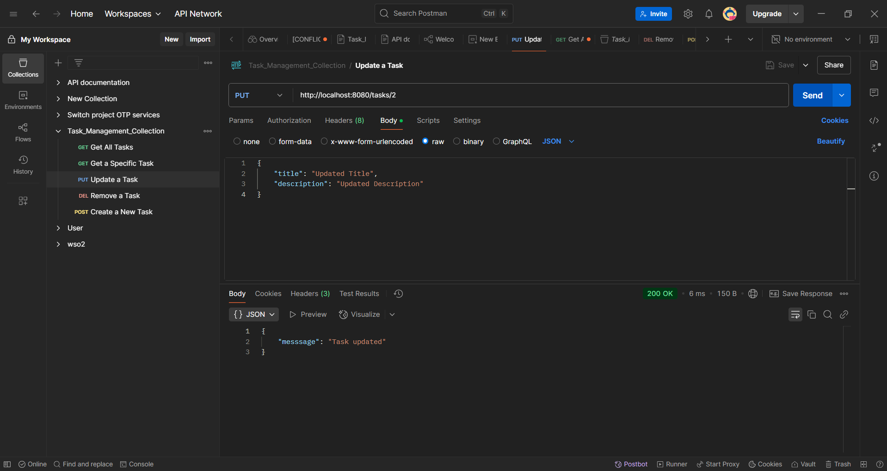
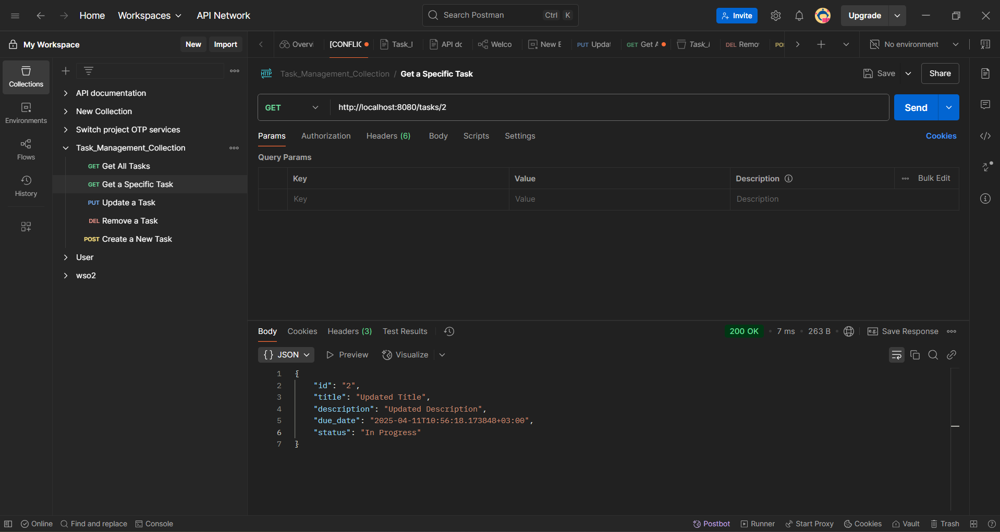
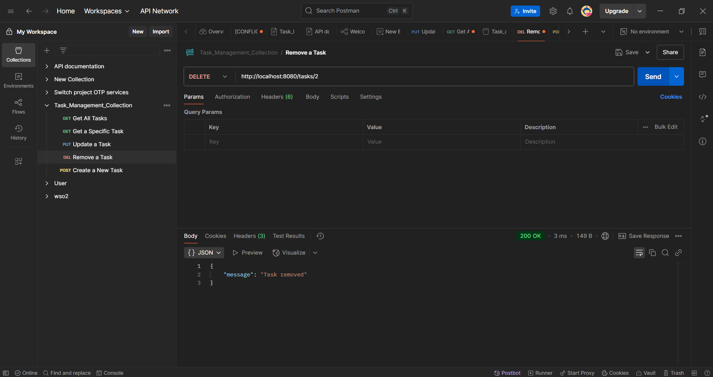
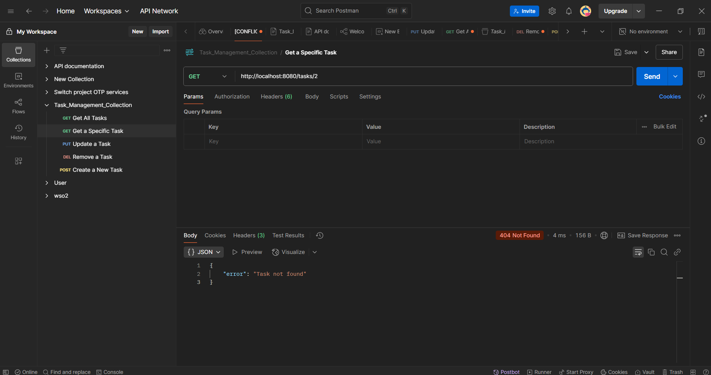
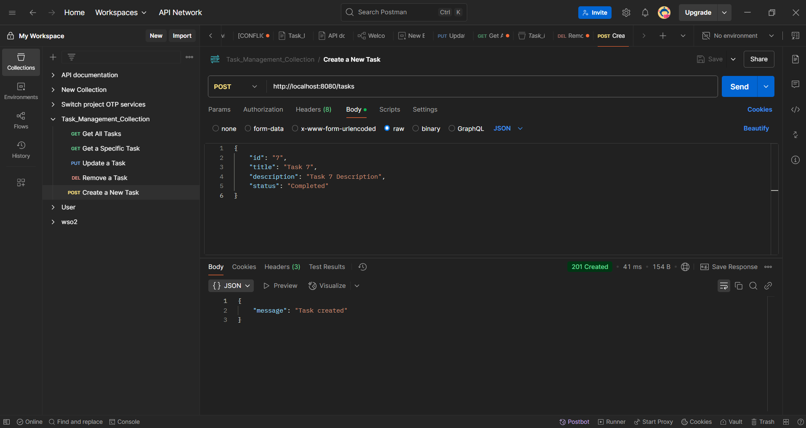

This read me page shows demonstration of the program when running including the images of the results.

1. Server running
   The server running in localhost on port 8080.
   

2. Folder structure

   - 

3. Task Management collection created on postman

   - 

4. Get All task api demonstration

   - 

5. Get a specific task

   - 

6. Update a specific task

   - update a specific task
     

   - check if a task is updated
     

7. Remove a specific task

   - remove a specific task
     

   - check if the removed task is removed
     

8. Task created
   - 
